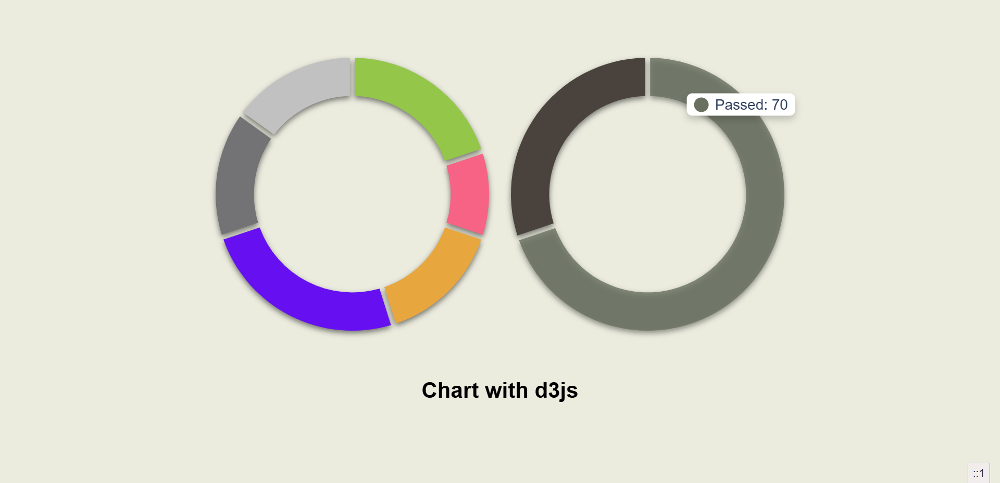

# D3.js Donut Chart React Component

<p align="center">
  
</p>

A React application that demonstrates the implementation of interactive donut charts using D3.js. The project showcases how to create beautiful, animated donut charts with hover effects and tooltips.

## Features

- Multiple donut charts rendering
- Smooth animations on chart load
- Interactive tooltips on hover
- Customizable colors and data
- Responsive design
- Shadow effects for better visualization

## Tech Stack

- React 18
- D3.js v7
- Vite
- CSS3

## Prerequisites

Before running this project, make sure you have:

- Node.js (v14 or higher)
- npm or yarn package manager

## Installation

1. Clone the repository:

    ```bash
    git clone <repository-url>
    ```

2. Navigate to the project directory:

    ```bash
    cd simple-chart-with-d3
    ```

3. Install dependencies:

    ```bash
    npm install
    ```

    or

    ```bash
    yarn
    ```

## Running the Application

To start the development server:

```bash
npm run dev
```

or

```bash
yarn dev
```

The application will be available at `http://localhost:5173`

## Project Structure

```bash
simple-chart-with-d3/
    ├── src/
    │ ├── App.jsx # Main application component
    │ ├── ChartComponent.jsx # Donut chart wrapper component
    │ ├── drawChart.jsx # D3.js chart rendering logic
    │ ├── index.css # Global styles
    │ └── main.jsx # Application entry point
    ├── index.html
    ├── package.json
    └── vite.config.js
```

## Usage

The donut chart component can be used by passing an array of data objects with the following structure:

```javascript
const data = [
    { label: "Label1", value: 20, color: "#94c64a" },
    { label: "Label2", value: 30, color: "#f66384" },
    // ...
];

<ChartComponent data={data} />
```

Each data object should contain:

- `label`: String - The name of the segment
- `value`: Number - The value determining the segment size
- `color`: String - The hex color code for the segment

## Building for Production

To create a production build:

```bash
npm run build
```

or

```bash
yarn build
```

The built files will be in the `dist` directory.

## License

MIT License

Copyright (c) 2024

Permission is hereby granted, free of charge, to any person obtaining a copy
of this software and associated documentation files (the "Software"), to deal
in the Software without restriction, including without limitation the rights
to use, copy, modify, merge, publish, distribute, sublicense, and/or sell
copies of the Software, and to permit persons to whom the Software is
furnished to do so, subject to the following conditions:

The above copyright notice and this permission notice shall be included in all
copies or substantial portions of the Software.

THE SOFTWARE IS PROVIDED "AS IS", WITHOUT WARRANTY OF ANY KIND, EXPRESS OR
IMPLIED, INCLUDING BUT NOT LIMITED TO THE WARRANTIES OF MERCHANTABILITY,
FITNESS FOR A PARTICULAR PURPOSE AND NONINFRINGEMENT. IN NO EVENT SHALL THE
AUTHORS OR COPYRIGHT HOLDERS BE LIABLE FOR ANY CLAIM, DAMAGES OR OTHER
LIABILITY, WHETHER IN AN ACTION OF CONTRACT, TORT OR OTHERWISE, ARISING FROM,
OUT OF OR IN CONNECTION WITH THE SOFTWARE OR THE USE OR OTHER DEALINGS IN THE
SOFTWARE.

## Contributing

Contributions are always welcome! Here's how you can help:

1. Fork the repository
2. Create a new branch (`git checkout -b feature/amazing-feature`)
3. Make your changes
4. Commit your changes (`git commit -m 'Add some amazing feature'`)
5. Push to the branch (`git push origin feature/amazing-feature`)
6. Open a Pull Request

### Guidelines for contributing

- Ensure any install or build dependencies are removed before the end of the layer when doing a build
- Update the README.md with details of changes to the interface, if applicable
- Follow the existing code style and formatting
- Write clear, descriptive commit messages
- Add appropriate comments to your code
- Test your changes thoroughly before submitting

For major changes, please open an issue first to discuss what you would like to change.
